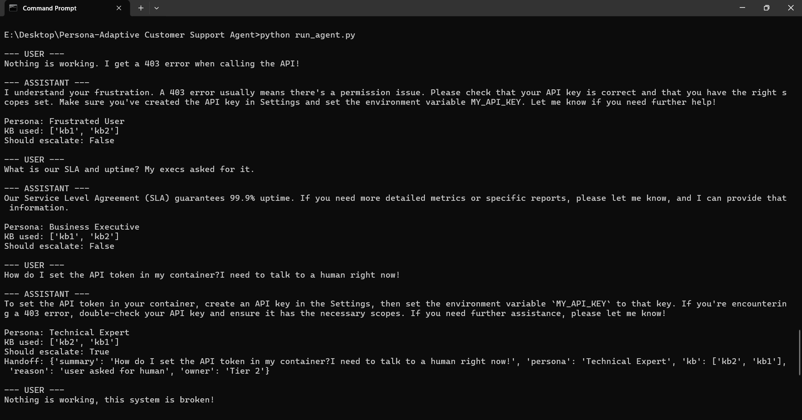

#I have build a Simple Agent 

How to run:

1. open you cmd
2. go to the folder saved location
   eg- E:\Desktop\Persona-Adaptive Customer Support Agent

   use cd to do it
3. set OPENAI_API_KEY=sk-xxxxxxx
4. python run_agent.py

IMPORTANT :- I have revoked my Api key , if you want to run this using llm use your own api key.
             Even without anApi key, it would run on its own.

             contact me for any more information.

Thank you for your time.